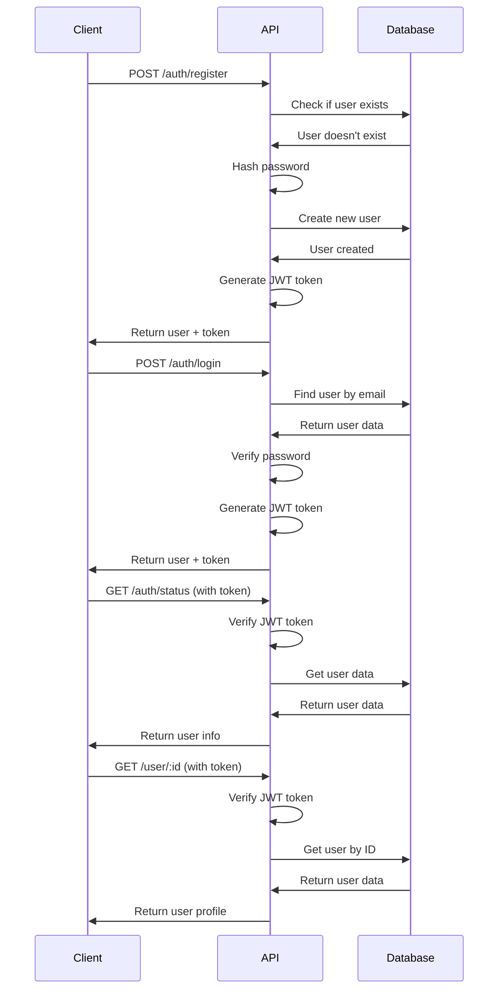
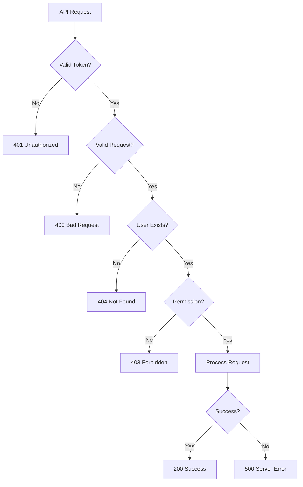

# 🔧 API Documentation

Complete API reference for the MERN Authentication System backend.

## 📋 Overview

The API follows RESTful conventions and provides endpoints for authentication, user management, and system operations.

**Base URL:** `http://localhost:5000/api` (development)  
**Authentication:** JWT Bearer tokens  
**Content-Type:** `application/json`

## 🔐 Authentication

All protected endpoints require a JWT token in the Authorization header:

```
Authorization: Bearer <jwt_token>
```

### Get Authentication Status

Check if the current user is authenticated.

```http
GET /api/auth/status
```

**Response (200):**
```json
{
  "user": {
    "id": "string",
    "name": "string",
    "email": "string",
    "role": "admin|manager|staff",
    "isActive": true,
    "lastLogin": "2024-01-01T00:00:00.000Z",
    "createdAt": "2024-01-01T00:00:00.000Z"
  }
}
```

**Response (401):**
```json
{
  "message": "No token provided"
}
```

### User Login

Authenticate a user and receive a JWT token.

```http
POST /api/auth/login
Content-Type: application/json

{
  "email": "user@example.com",
  "password": "password123"
}
```

**Response (200):**
```json
{
  "data": {
    "user": {
      "id": "string",
      "name": "string",
      "email": "string",
      "role": "admin|manager|staff",
      "isActive": true,
      "lastLogin": "2024-01-01T00:00:00.000Z",
      "createdAt": "2024-01-01T00:00:00.000Z"
    },
    "token": "eyJhbGciOiJIUzI1NiIsInR5cCI6IkpXVCJ9..."
  }
}
```

**Response (400):**
```json
{
  "message": "Invalid credentials"
}
```

**Response (422):**
```json
{
  "errors": [
    {
      "field": "email",
      "message": "Email is required"
    }
  ]
}
```

### User Registration

Create a new user account.

```http
POST /api/auth/register
Content-Type: application/json

{
  "name": "John Doe",
  "email": "john@example.com",
  "password": "password123",
  "role": "staff"
}
```

**Parameters:**
- `name` (required): User's full name (2-50 characters)
- `email` (required): Valid email address
- `password` (required): Password (minimum 6 characters)
- `role` (optional): User role (admin/manager/staff), defaults to "staff"

**Response (201):**
```json
{
  "data": {
    "user": {
      "id": "string",
      "name": "John Doe",
      "email": "john@example.com",
      "role": "staff",
      "isActive": true,
      "lastLogin": null,
      "createdAt": "2024-01-01T00:00:00.000Z"
    },
    "token": "eyJhbGciOiJIUzI1NiIsInR5cCI6IkpXVCJ9..."
  }
}
```

**Response (409):**
```json
{
  "message": "User already exists"
}
```

## 👤 User Management

### Get User Profile

Retrieve a user's profile information by ID.

```http
GET /api/user/:id
Authorization: Bearer <token>
```

**Parameters:**
- `id` (path): User ID

**Response (200):**
```json
{
  "success": true,
  "user": {
    "id": "string",
    "name": "John Doe",
    "email": "john@example.com",
    "role": "staff",
    "createdAt": "2024-01-01T00:00:00.000Z",
    "lastLogin": "2024-01-01T00:00:00.000Z"
  }
}
```

**Response (403):**
```json
{
  "message": "Unauthorized to access this user"
}
```

**Response (404):**
```json
{
  "message": "User not found"
}
```

## 📊 API Response Format

### Success Response

```json
{
  "success": true,
  "data": { ... },
  "message": "Optional success message"
}
```

### Error Response

```json
{
  "success": false,
  "message": "Error description",
  "errors": [
    {
      "field": "fieldName",
      "message": "Validation error message"
    }
  ]
}
```

## 🚨 Error Codes

| Status Code | Meaning |
|-------------|---------|
| 200 | OK - Request successful |
| 201 | Created - Resource created successfully |
| 400 | Bad Request - Invalid request data |
| 401 | Unauthorized - Authentication required |
| 403 | Forbidden - Insufficient permissions |
| 404 | Not Found - Resource not found |
| 409 | Conflict - Resource already exists |
| 422 | Unprocessable Entity - Validation errors |
| 429 | Too Many Requests - Rate limit exceeded |
| 500 | Internal Server Error - Server error |

## 🔒 Security Features

### JWT Authentication
- Tokens expire after 7 days
- Tokens are validated on each protected request
- Tokens contain user ID and role information

### Rate Limiting
- 100 requests per 15 minutes per IP
- Applied to all authentication endpoints

### Input Validation
- Email format validation
- Password strength requirements
- XSS protection via input sanitization

### CORS Protection
- Configured to allow requests from frontend domain
- Preflight requests handled automatically

## 🧪 Testing API Endpoints

### Using cURL

**Login:**
```bash
curl -X POST http://localhost:5000/api/auth/login \
  -H "Content-Type: application/json" \
  -d '{"email":"user@example.com","password":"password123"}'
```

**Get Profile (with token):**
```bash
curl -X GET http://localhost:5000/api/user/user_id \
  -H "Authorization: Bearer YOUR_JWT_TOKEN"
```

### Using Postman/Insomnia

1. Create a new request
2. Set method and URL
3. Add headers (Authorization for protected routes)
4. Add body for POST requests
5. Send request and view response

## 🔄 API Workflow Examples

### Complete Authentication Flow



### Error Handling Flow



## 📈 Rate Limiting

Rate limits are applied per IP address:

- **Authentication endpoints**: 5 requests per minute
- **User management endpoints**: 30 requests per minute
- **General endpoints**: 100 requests per 15 minutes

When rate limit is exceeded:

```json
{
  "message": "Too many requests",
  "retryAfter": 60
}
```

## 🔍 Monitoring & Logging

### Request Logging
All API requests are logged with:
- Timestamp
- IP address
- User ID (if authenticated)
- Endpoint
- Response status
- Response time

### Error Logging
Application errors are logged with:
- Error stack trace
- Request context
- User information
- Timestamp

## 🚀 Performance Optimization

### Database Indexing
- Email field indexed for fast user lookups
- CreatedAt field indexed for sorting
- Role field indexed for filtering

### Caching Strategy
- JWT token validation cached for 5 minutes
- User data cached for authenticated requests

### Connection Pooling
- MongoDB connection pool configured
- Connection limits and timeouts set

## 🔧 Configuration

API configuration is managed through environment variables:

```env
# Server
PORT=5000
NODE_ENV=development

# Database
MONGODB_URI=mongodb://localhost:27017/mern_auth_db

# JWT
JWT_SECRET=your-secret-key
JWT_EXPIRES_IN=7d

# CORS
FRONTEND_URL=http://localhost:3000

# Rate Limiting
RATE_LIMIT_WINDOW=15
RATE_LIMIT_MAX=100

# Bcrypt
BCRYPT_ROUNDS=12
```

## 🧪 Testing

### Unit Tests
```bash
cd backend
npm test
```

### Integration Tests
```bash
cd backend
npm run test:integration
```

### API Testing with Newman
```bash
cd backend
npm run test:api
```

## 📚 Additional Resources

- [Express.js Documentation](https://expressjs.com/)
- [Mongoose Documentation](https://mongoosejs.com/)
- [JWT.io](https://jwt.io/)
- [REST API Design Best Practices](https://restfulapi.net/)

---

**API Version:** 1.0.0  
**Last Updated:** November 2025  
**Contact:** API Support Team
