# 🏗️ System Architecture

Comprehensive overview of the MERN Authentication System architecture, design patterns, and technical decisions.

## 🏛️ High-Level Architecture

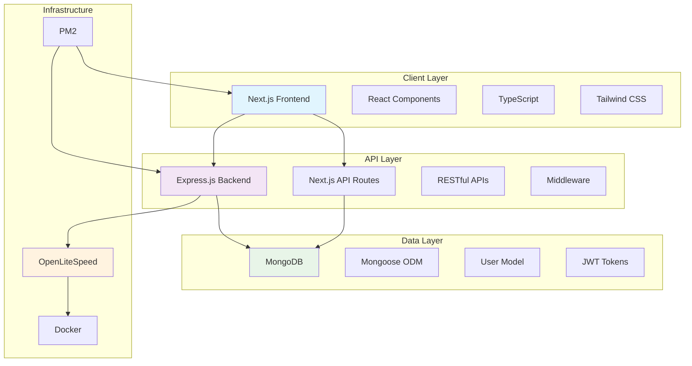

## 🏗️ Detailed Architecture

### Frontend Architecture (Next.js 15)

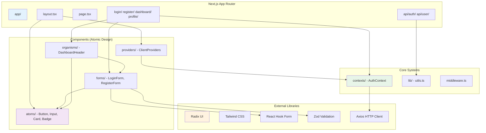

### Backend Architecture (Express.js)

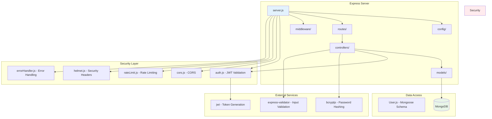

## 🔐 Authentication Flow

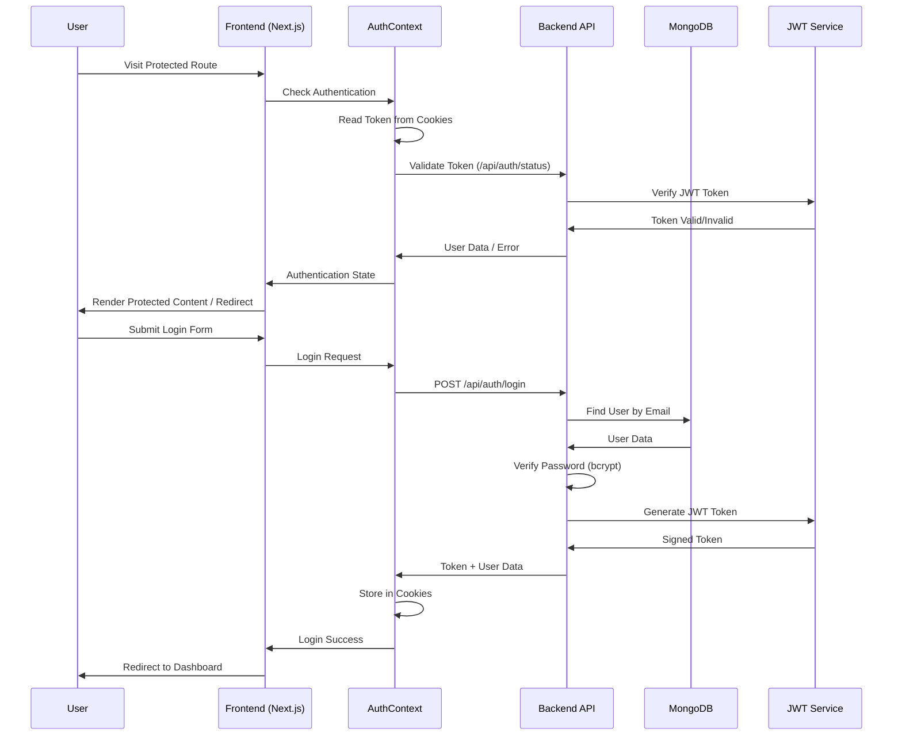

## 🎨 Component Architecture (Atomic Design)

```mermaid
stateDiagram-v2
    [*] --> Atoms: Basic UI Components
    Atoms --> Molecules: Combine Atoms
    Molecules --> Organisms: Complex Combinations
    Organisms --> Templates: Page Layouts
    Templates --> Pages: Specific Pages

    state Atoms as "Atoms\n• Button\n• Input\n• Card\n• Badge\n• Label"
    state Molecules as "Molecules\n• LoginForm\n• RegisterForm\n• Form Fields"
    state Organisms as "Organisms\n• DashboardHeader\n• Navigation\n• Data Tables"
    state Templates as "Templates\n• Auth Layout\n• Dashboard Layout\n• Profile Layout"
    state Pages as "Pages\n• /login\n• /dashboard\n• /profile"

    note right of Pages : Final Implementation
    note right of Templates : Reusable Layouts
    note right of Organisms : Complex Components
    note right of Molecules : Functional Groups
    note right of Atoms : Basic Elements
```

## 🗂️ Data Flow Architecture

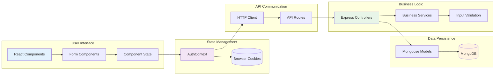

## 🔄 Request-Response Flow

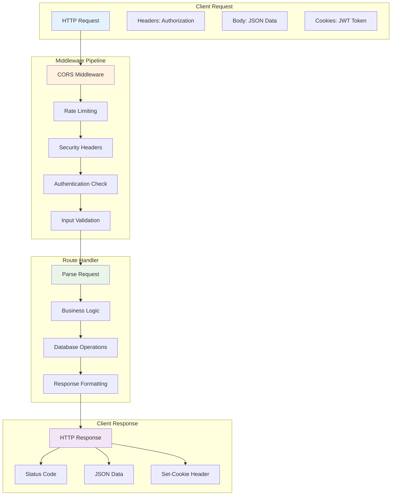

## 🗃️ Database Schema

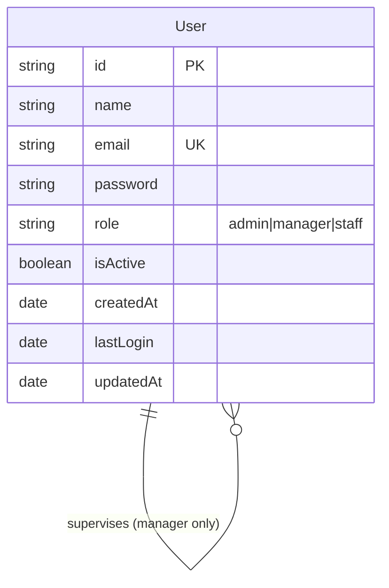

## 🔒 Security Architecture

```mermaid
graph TD
    subgraph "Client Security"
        CS1[JWT in HttpOnly Cookies]
        CS2[CORS Protection]
        CS3[Input Sanitization]
        CS4[CSRF Protection]
    end

    subgraph "Server Security"
        SS1[JWT Token Validation]
        SS2[Password Hashing (bcrypt)]
        SS3[Rate Limiting]
        SS4[Security Headers (Helmet)]
        SS5[Input Validation]
        SS6[SQL Injection Prevention]
    end

    subgraph "Data Security"
        DS1[MongoDB Injection Prevention]
        DS2[Data Encryption at Rest]
        DS3[Secure Password Storage]
        DS4[Audit Logging]
    end

    subgraph "Infrastructure Security"
        IS1[Environment Variables]
        IS2[HTTPS Only]
        IS3[Firewall Configuration]
        IS4[Regular Security Updates]
    end

    CS1 --> SS1
    CS2 --> SS2
    CS3 --> SS5
    SS1 --> DS1
    SS2 --> DS3
    SS3 --> IS1
    SS4 --> IS2

    style CS1 fill:#e3f2fd
    style SS1 fill:#ffebee
    style DS1 fill:#e8f5e8
    style IS1 fill:#fff3e0
```

## 📊 Performance Architecture

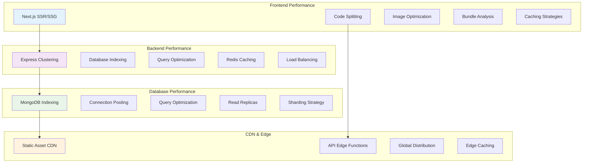

## 🚀 Deployment Architecture

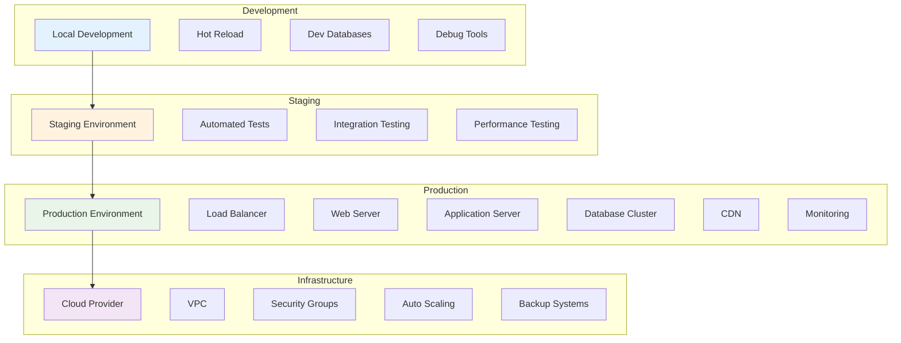

## 🎯 Design Patterns Used

### Frontend Patterns
- **Atomic Design**: Component composition hierarchy
- **Container/Presentational**: Separation of logic and presentation
- **Custom Hooks**: Reusable stateful logic
- **Compound Components**: Related component groups

### Backend Patterns
- **MVC Architecture**: Model-View-Controller separation
- **Middleware Chain**: Request processing pipeline
- **Repository Pattern**: Data access abstraction
- **Dependency Injection**: Modular service architecture

### Security Patterns
- **JWT Token Authentication**: Stateless authentication
- **Role-Based Access Control**: Permission-based authorization
- **Input Validation**: Request sanitization
- **Error Handling**: Centralized error management

## 🔧 Configuration Architecture

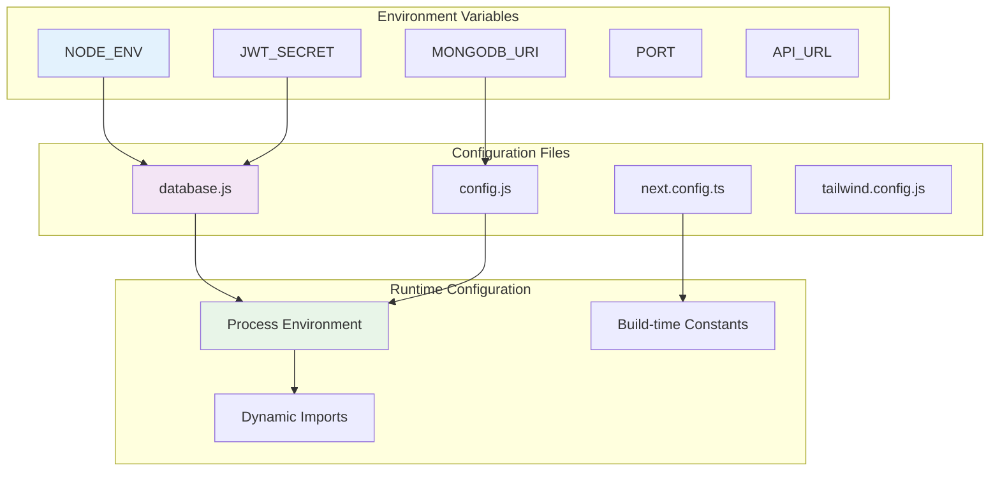

## 📈 Scalability Considerations

### Horizontal Scaling
- **Stateless Design**: No server-side sessions
- **Database Sharding**: MongoDB sharding for large datasets
- **Load Balancing**: Multiple application instances
- **CDN Integration**: Static asset distribution

### Vertical Scaling
- **Database Optimization**: Indexing and query optimization
- **Caching Layer**: Redis for frequently accessed data
- **Background Jobs**: Queue system for heavy operations
- **Microservices**: Service decomposition for complex features

### Monitoring & Observability
- **Application Metrics**: Response times, error rates
- **Infrastructure Monitoring**: CPU, memory, disk usage
- **Log Aggregation**: Centralized logging system
- **Alerting**: Automated incident response

## 🔄 CI/CD Pipeline Architecture

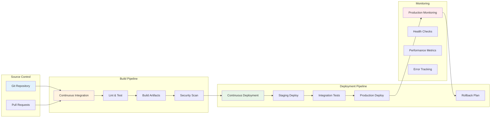

This architecture provides a solid foundation for a scalable, secure, and maintainable MERN authentication system with clear separation of concerns and modern development practices.
