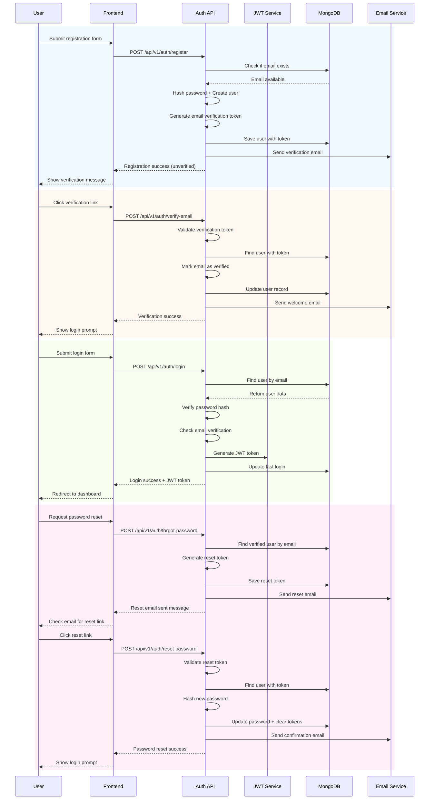
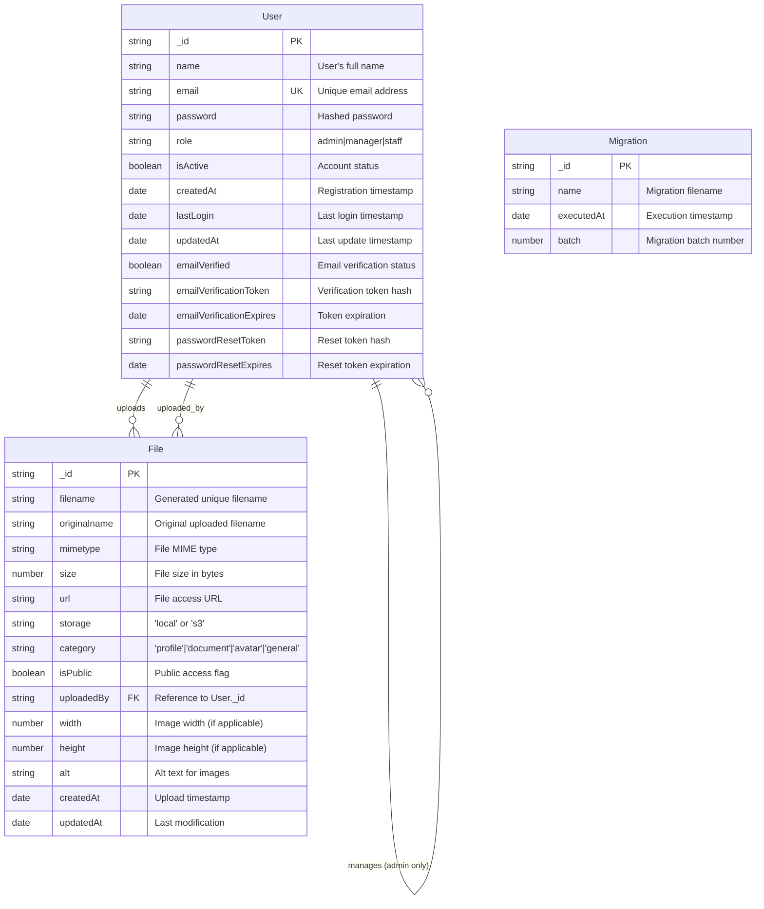
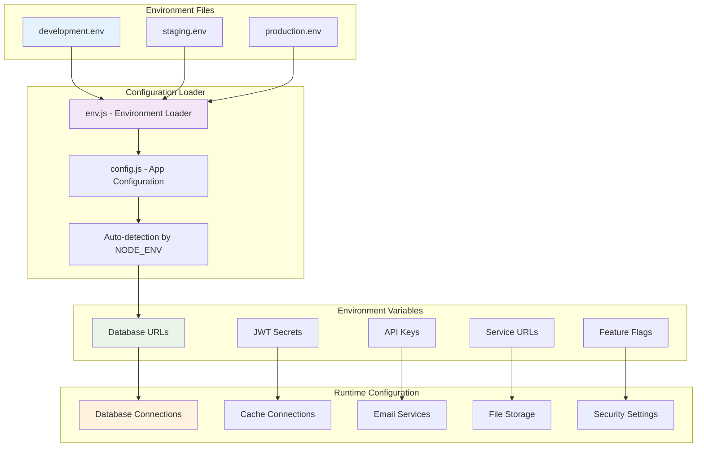

# 🚀 Backend Implementation Guide

Complete technical documentation for the Express.js backend with advanced features, security, and scalability.

## 🏗️ Backend Architecture Overview

```mermaid
graph TB
    subgraph "Client Layer"
        C1[Next.js Frontend]
        C2[React Components]
        C3[HTTP Client (Axios)]
    end

    subgraph "API Gateway Layer"
        GW1[Express Server]
        GW2[CORS Handling]
        GW3[Rate Limiting]
        GW4[Security Headers]
    end

    subgraph "Application Layer"
        A1[Authentication Controller]
        A2[User Management Controller]
        A3[File Upload Controller]
        A4[Middleware Pipeline]
        A5[Input Validation]
        A6[Error Handling]
    end

    subgraph "Data Access Layer"
        D1[Mongoose Models]
        D2[MongoDB Collections]
        D3[Redis Cache]
        D4[File Storage (S3/Local)]
    end

    subgraph "Infrastructure Layer"
        I1[Docker Containers]
        I2[Environment Config]
        I3[Process Management]
        I4[Health Monitoring]
    end

    C1 --> GW1
    GW1 --> A1
    GW1 --> A2
    GW1 --> A3
    A1 --> D1
    A2 --> D1
    A3 --> D4
    D1 --> D2
    D1 --> D3
    A4 --> A5
    A5 --> A6
    I1 --> GW1
    I2 --> GW1
    I3 --> GW1
    I4 --> GW1

    style C1 fill:#e3f2fd
    style GW1 fill:#f3e5f5
    style A1 fill:#e8f5e8
    style D1 fill:#fff3e0
    style I1 fill:#ffebee
```

## 📁 Project Structure

```
backend/
├── config/                 # Configuration files
│   ├── config.js          # Main configuration
│   ├── database.js        # MongoDB connection
│   ├── email.js           # Email service (Nodemailer)
│   ├── upload.js          # File upload configuration
│   ├── redis.js           # Redis cache configuration
│   ├── monitoring.js      # API monitoring
│   ├── swagger.js         # API documentation
│   └── env.js             # Environment loader
├── controllers/           # Request handlers
│   ├── auth-controller.js # Authentication logic
│   ├── user-controller.js # User management
│   └── file-controller.js # File operations
├── middleware/            # Express middleware
│   ├── auth.js            # JWT authentication
│   ├── authorization.js   # Role-based permissions
│   ├── cache.js           # Redis caching
│   ├── validation.js      # Input validation
│   └── security.js        # Security features
├── models/                # Database schemas
│   ├── user-model.js      # User schema
│   └── file-model.js      # File metadata schema
├── routes/                # API routes
│   └── v1/                # Versioned API routes
│       ├── index.js       # Main router
│       ├── auth.js        # Authentication routes
│       ├── users.js       # User management routes
│       └── files.js       # File management routes
├── utils/                 # Utility functions
│   ├── crypto.js          # Token generation
│   └── migrations.js      # Database migrations
├── seeds/                 # Database seed data
├── migrations/            # Schema migrations
├── env/                   # Environment configurations
├── scripts/               # CLI scripts
└── uploads/               # Local file storage (gitignored)
```

## 🔐 Authentication Flow



## 🗄️ Database Schema



## 🔄 Request Processing Pipeline

```mermaid
graph TD
    subgraph "Incoming Request"
        RQ1[HTTP Request]
        RQ2[Headers + Body]
        RQ3[Query Parameters]
    end

    subgraph "Global Middleware"
        GM1[CORS Middleware]
        GM2[Rate Limiting]
        GM3[Security Headers (Helmet)]
        GM4[Request Logging]
        GM5[API Monitoring]
        GM6[Correlation ID]
    end

    subgraph "Route-Specific Middleware"
        RM1[Authentication Check]
        RM2[Role Authorization]
        RM3[Cache Middleware]
        RM4[Input Validation]
        RM5[File Upload Handling]
    end

    subgraph "Business Logic"
        BL1[Controller Logic]
        BL2[Service Layer]
        BL3[Data Validation]
        BL4[Business Rules]
    end

    subgraph "Data Operations"
        DO1[Mongoose Models]
        DO2[MongoDB Queries]
        DO3[Redis Cache]
        DO4[File Operations]
    end

    subgraph "Response Processing"
        RP1[Data Formatting]
        RP2[Cache Storage]
        RP3[Response Headers]
        RP4[HTTP Response]
    end

    RQ1 --> GM1
    GM1 --> GM2
    GM2 --> GM3
    GM3 --> GM4
    GM4 --> GM5
    GM5 --> GM6
    GM6 --> RM1
    RM1 --> RM2
    RM2 --> RM3
    RM3 --> RM4
    RM4 --> RM5
    RM5 --> BL1
    BL1 --> BL2
    BL2 --> BL3
    BL3 --> BL4
    BL4 --> DO1
    DO1 --> DO2
    DO1 --> DO3
    DO1 --> DO4
    DO4 --> RP1
    RP1 --> RP2
    RP2 --> RP3
    RP3 --> RP4

    style RQ1 fill:#e3f2fd
    style GM1 fill:#fff3e0
    style RM1 fill:#f3e5f5
    style BL1 fill:#e8f5e8
    style DO1 fill:#ffebee
    style RP1 fill:#e1f5fe
```

## 🔒 Security Architecture

```mermaid
graph TD
    subgraph "Authentication Security"
        AS1[JWT Token Validation]
        AS2[Password Hashing (bcrypt)]
        AS3[Email Verification]
        AS4[Secure Token Generation]
        AS5[Token Expiration Handling]
    end

    subgraph "Authorization Security"
        AZ1[Role-Based Access Control]
        AZ2[Route-Level Permissions]
        AZ3[Resource Ownership Checks]
        AZ4[Admin-Only Operations]
    end

    subgraph "Input Security"
        IS1[Request Sanitization]
        IS2[Schema Validation]
        IS3[SQL Injection Prevention]
        IS4[XSS Protection]
        IS5[File Upload Validation]
    end

    subgraph "Infrastructure Security"
        IF1[Rate Limiting]
        IF2[CORS Configuration]
        IF3[Security Headers (Helmet)]
        IF4[Environment Variable Protection]
        IF5[Error Information Leakage Prevention]
    end

    subgraph "Data Security"
        DS1[MongoDB Injection Prevention]
        DS2[Secure Password Storage]
        DS3[File Access Control]
        DS4[Audit Logging]
        DS5[Data Encryption]
    end

    AS1 --> AZ1
    AS2 --> DS2
    AS3 --> AS4
    AZ1 --> AZ2
    AZ2 --> AZ3
    IS1 --> IS2
    IS2 --> IS3
    IF1 --> IF2
    IF2 --> IF3
    DS1 --> DS2

    style AS1 fill:#e3f2fd
    style AZ1 fill:#f3e5f5
    style IS1 fill:#e8f5e8
    style IF1 fill:#fff3e0
    style DS1 fill:#ffebee
```

## 📊 API Monitoring & Metrics

```mermaid
graph TD
    subgraph "Request Monitoring"
        RM1[Request Interceptor]
        RM2[Response Time Tracking]
        RM3[Status Code Recording]
        RM4[Endpoint Statistics]
        RM5[Error Rate Calculation]
    end

    subgraph "Performance Metrics"
        PM1[Average Response Time]
        PM2[95th Percentile (P95)]
        PM3[99th Percentile (P99)]
        PM4[Requests Per Second]
        PM5[Error Rate Percentage]
    end

    subgraph "System Metrics"
        SM1[Memory Usage]
        SM2[CPU Utilization]
        SM3[Database Connections]
        SM4[Cache Hit Rate]
        SM5[Active Sessions]
    end

    subgraph "Alerting & Reporting"
        AR1[Threshold Monitoring]
        AR2[Automated Alerts]
        AR3[Performance Reports]
        AR4[Error Notifications]
        AR5[Health Dashboard]
    end

    RM1 --> PM1
    RM2 --> PM2
    RM3 --> PM3
    RM4 --> PM4
    RM5 --> PM5
    SM1 --> AR1
    SM2 --> AR2
    SM3 --> AR3
    SM4 --> AR4
    SM5 --> AR5

    style RM1 fill:#e3f2fd
    style PM1 fill:#f3e5f5
    style SM1 fill:#e8f5e8
    style AR1 fill:#fff3e0
```

## 🚀 Caching Strategy

```mermaid
graph TD
    subgraph "Cache Layers"
        CL1[Browser Cache]
        CL2[CDN Cache]
        CL3[Application Cache (Redis)]
        CL4[Database Cache]
    end

    subgraph "Cache Types"
        CT1[API Response Cache]
        CT2[User Data Cache]
        CT3[File Metadata Cache]
        CT4[Session Cache]
    end

    subgraph "Cache Policies"
        CP1[Time-based Expiration]
        CP2[LRU Eviction]
        CP3[Manual Invalidation]
        CP4[Event-driven Updates]
    end

    subgraph "Cache Benefits"
        CB1[Faster Response Times]
        CB2[Reduced Database Load]
        CB3[Improved Scalability]
        CB4[Better User Experience]
    end

    CL1 --> CT1
    CL2 --> CT2
    CL3 --> CT3
    CL4 --> CT4
    CT1 --> CP1
    CT2 --> CP2
    CT3 --> CP3
    CT4 --> CP4
    CP1 --> CB1
    CP2 --> CB2
    CP3 --> CB3
    CP4 --> CB4

    style CL1 fill:#e3f2fd
    style CT1 fill:#f3e5f5
    style CP1 fill:#e8f5e8
    style CB1 fill:#fff3e0
```

## 🔧 Environment Management



## 📈 Scalability Features

```mermaid
graph TD
    subgraph "Horizontal Scaling"
        HS1[Stateless Application]
        HS2[Load Balancer]
        HS3[Multiple App Instances]
        HS4[Session Storage in Redis]
        HS5[Shared File Storage (S3)]
    end

    subgraph "Database Scaling"
        DS1[MongoDB Sharding]
        DS2[Read Replicas]
        DS3[Connection Pooling]
        DS4[Query Optimization]
        DS5[Database Indexing]
    end

    subgraph "Cache Scaling"
        CS1[Redis Cluster]
        CS2[Cache Distribution]
        CS3[Cache Warming]
        CS4[Cache Invalidation]
        CS5[Multi-region Cache]
    end

    subgraph "CDN & Edge"
        CE1[Static Asset CDN]
        CE2[API Edge Functions]
        CE3[Global Distribution]
        CE4[Edge Caching]
        CE5[Geo-based Routing]
    end

    HS1 --> HS2
    HS2 --> HS3
    HS3 --> HS4
    HS4 --> HS5
    DS1 --> DS2
    DS2 --> DS3
    DS3 --> DS4
    DS4 --> DS5
    CS1 --> CS2
    CS2 --> CS3
    CS3 --> CS4
    CS4 --> CS5
    CE1 --> CE2
    CE2 --> CE3
    CE3 --> CE4
    CE4 --> CE5

    style HS1 fill:#e3f2fd
    style DS1 fill:#f3e5f5
    style CS1 fill:#e8f5f8
    style CE1 fill:#fff3e0
```

## 🔧 API Development Workflow

```mermaid
stateDiagram-v2
    [*] --> Planning: API Requirement
    Planning --> Design: API Specification
    Design --> Implementation: Code Development
    Implementation --> Testing: Unit & Integration Tests
    Testing --> Documentation: Update API Docs
    Documentation --> Deployment: Environment Setup
    Deployment --> Monitoring: Performance Tracking

    Monitoring --> Optimization: Performance Issues
    Optimization --> Implementation

    Monitoring --> [*]: API Complete

    Testing --> BugFix: Test Failures
    BugFix --> Implementation

    state Planning as "📋 Planning"
    state Design as "🎨 Design"
    state Implementation as "💻 Implementation"
    state Testing as "🧪 Testing"
    state Documentation as "📚 Documentation"
    state Deployment as "🚀 Deployment"
    state Monitoring as "📊 Monitoring"
    state Optimization as "⚡ Optimization"
    state BugFix as "🐛 Bug Fix"

    note right of Planning : Define endpoints, data models
    note right of Design : Create API specifications
    note right of Implementation : Write controllers, middleware
    note right of Testing : Run comprehensive tests
    note right of Documentation : Update Swagger docs
    note right of Deployment : Configure environments
    note right of Monitoring : Track performance metrics
```

## 🎯 Key Implementation Features

### **Authentication & Security**
- JWT-based authentication with role-based access control
- Email verification and password reset flows
- Secure password hashing with bcrypt
- Rate limiting and security headers
- Input validation and sanitization

### **Data Management**
- MongoDB with Mongoose ODM
- Database migrations and seeding
- Redis caching for performance
- File upload with local/S3 storage

### **API Features**
- RESTful API design with versioning
- Comprehensive error handling
- Request correlation IDs
- API monitoring and metrics
- Swagger documentation

### **Developer Experience**
- Environment-based configuration
- Hot reload for development
- Docker containerization
- Comprehensive logging
- Automated testing setup

---

## 🚀 Quick Start

1. **Setup Environment:**
   ```bash
   cd backend
   cp env-example.txt .env  # Copy for development
   # Edit .env with your settings
   ```

2. **Install Dependencies:**
   ```bash
   npm install
   ```

3. **Start Development Services:**
   ```bash
   # Start MailHog, MongoDB, Redis
   docker-compose --env-file env/development.env up -d
   ```

4. **Run Database Setup:**
   ```bash
   npm run migrate  # Run migrations
   npm run seed     # Seed data
   ```

5. **Start Development Server:**
   ```bash
   npm run dev
   ```

6. **Access API:**
   - **API Base:** `http://localhost:5000/api/v1`
   - **Swagger Docs:** `http://localhost:5000/api-docs`
   - **Health Check:** `http://localhost:5000/api/v1/health`
   - **MailHog:** `http://localhost:8025`

## 📚 Additional Resources

- [Express.js Documentation](https://expressjs.com/)
- [Mongoose ODM](https://mongoosejs.com/)
- [JWT.io](https://jwt.io/)
- [Redis Documentation](https://redis.io/documentation)
- [AWS SDK for JavaScript](https://docs.aws.amazon.com/sdk-for-javascript/)

---

**Built with modern Node.js practices, comprehensive security, and enterprise-grade scalability.**
