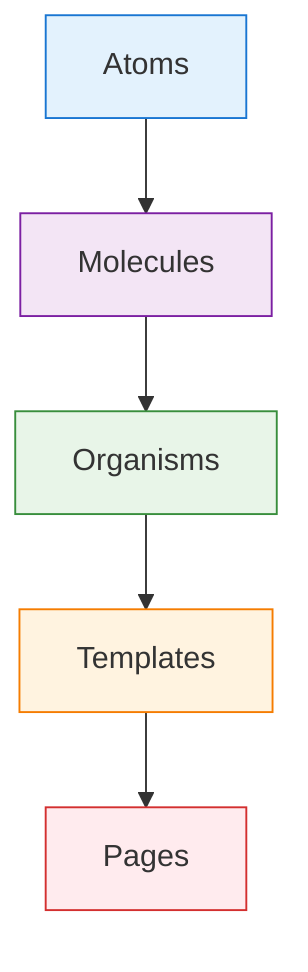
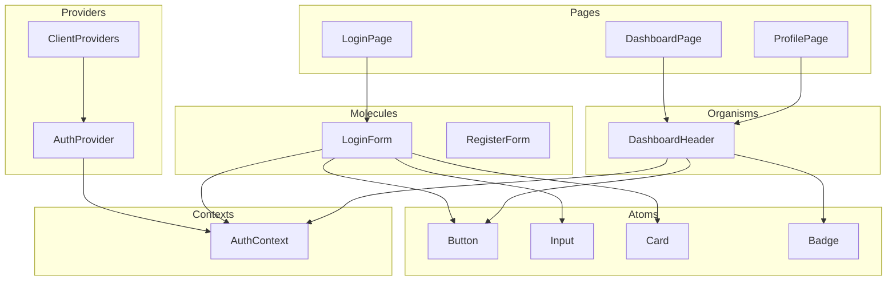

# 🧩 Component Architecture

Detailed documentation of the frontend component structure following atomic design principles.

## 🎨 Atomic Design Overview

This project follows the **Atomic Design** methodology, organizing components into hierarchical levels of complexity:



## 🧬 Atoms (Basic Building Blocks)

Atoms are the smallest, indivisible components that serve as the foundation for all other components.

### Location: `src/components/atoms/`

#### Button (`button.tsx`)
A versatile button component with multiple variants and sizes.

**Props:**
```typescript
interface ButtonProps extends React.ButtonHTMLAttributes<HTMLButtonElement> {
  variant?: 'default' | 'destructive' | 'outline' | 'secondary' | 'ghost' | 'link'
  size?: 'default' | 'sm' | 'lg' | 'icon'
  asChild?: boolean
}
```

**Usage:**
```tsx
import { Button } from '@/components/atoms/button'

// Basic usage
<Button>Click me</Button>

// Variants
<Button variant="destructive">Delete</Button>
<Button variant="outline">Cancel</Button>

// Sizes
<Button size="sm">Small</Button>
<Button size="lg">Large</Button>
```

#### Input (`input.tsx`)
A styled input component that extends HTML input functionality.

**Props:**
```typescript
interface InputProps extends React.InputHTMLAttributes<HTMLInputElement> {}
```

**Usage:**
```tsx
import { Input } from '@/components/atoms/input'

<Input
  type="email"
  placeholder="Enter your email"
  disabled={isLoading}
/>
```

#### Card (`card.tsx`)
A container component for grouping related content.

**Components:**
- `Card`: Main container
- `CardHeader`: Header section
- `CardTitle`: Title within header
- `CardDescription`: Description text
- `CardContent`: Main content area
- `CardFooter`: Footer section

**Usage:**
```tsx
import { Card, CardHeader, CardTitle, CardContent } from '@/components/atoms/card'

<Card>
  <CardHeader>
    <CardTitle>Card Title</CardTitle>
  </CardHeader>
  <CardContent>
    <p>Card content goes here</p>
  </CardContent>
</Card>
```

#### Badge (`badge.tsx`)
A small status indicator component.

**Props:**
```typescript
interface BadgeProps extends React.HTMLAttributes<HTMLDivElement> {
  variant?: 'default' | 'secondary' | 'destructive' | 'outline'
}
```

**Usage:**
```tsx
import { Badge } from '@/components/atoms/badge'

<Badge variant="destructive">Admin</Badge>
<Badge variant="secondary">Manager</Badge>
```

#### Label (`label.tsx`)
A form label component with Radix UI integration.

#### Toast Components (`toast.tsx`, `toaster.tsx`, `use-toast.ts`)
Notification system components for displaying messages.

## 🧪 Molecules (Component Combinations)

Molecules are groups of atoms bonded together to form more complex, functional components.

### Location: `src/components/forms/`

#### LoginForm (`forms/LoginForm.tsx`)
A complete login form combining input atoms with validation and authentication logic.

**Features:**
- Email and password inputs
- Form validation with Zod
- React Hook Form integration
- Loading states
- Error handling
- Toast notifications

**Usage:**
```tsx
import { LoginForm } from '@/components/forms/LoginForm'

function LoginPage() {
  return (
    <div className="container mx-auto p-4">
      <LoginForm />
    </div>
  )
}
```

#### RegisterForm (`forms/RegisterForm.tsx`)
A registration form with name, email, and password fields.

**Features:**
- Multiple input fields
- Password confirmation (can be added)
- Role selection
- Form validation
- Authentication integration

## 🦕 Organisms (Complex Components)

Organisms are complex components that combine molecules and atoms to form distinct sections of an interface.

### Location: `src/components/organisms/`

#### DashboardHeader (`organisms/DashboardHeader.tsx`)
A complex header component for dashboard pages.

**Features:**
- User information display
- Role-based badges
- Navigation elements
- Logout functionality
- Responsive design

**Props:**
```typescript
interface DashboardHeaderProps {
  title?: string
  showBackButton?: boolean
  backHref?: string
  backLabel?: string
}
```

**Usage:**
```tsx
import { DashboardHeader } from '@/components/organisms/DashboardHeader'

function DashboardPage() {
  return (
    <div>
      <DashboardHeader title="My Dashboard" />
      {/* Dashboard content */}
    </div>
  )
}
```

## 🔌 Providers (Context Providers)

### Location: `src/components/providers/`

#### ClientProviders (`providers/ClientProviders.tsx`)
A client-side provider that wraps all client-side contexts and components.

**Features:**
- AuthProvider integration
- Toast provider
- Centralized client-side state management

## 🎭 Pages (Route Components)

Pages are the top-level components that represent entire routes/views in the application.

### Location: `src/app/`

#### Authentication Pages
- `/login` - Login page using LoginForm molecule
- `/register` - Registration page using RegisterForm molecule

#### Dashboard Pages
- `/dashboard` - Main dashboard with role-based content
- `/dashboard/[role]` - Dynamic role-specific dashboard

#### Profile Pages
- `/profile` - User profile management

## 🔄 Component Communication Flow



## 🎯 Component Design Patterns

### 1. Compound Components Pattern
Used in Card components for flexible composition:

```tsx
<Card>
  <CardHeader>
    <CardTitle>Title</CardTitle>
    <CardDescription>Description</CardDescription>
  </CardHeader>
  <CardContent>
    {/* Content */}
  </CardContent>
</Card>
```

### 2. Render Props Pattern
Used in form components for flexible rendering:

```tsx
<LoginForm
  render={({ isLoading, error }) => (
    <div>
      {error && <ErrorMessage message={error} />}
      <Button disabled={isLoading}>
        {isLoading ? 'Logging in...' : 'Login'}
      </Button>
    </div>
  )}
/>
```

### 3. Custom Hooks Pattern
Used for reusable logic:

```tsx
const { user, login, logout } = useAuth()
const { toast } = useToast()
```

### 4. Composition over Inheritance
Components are composed rather than extended:

```tsx
// Instead of extending Button
<Button variant="destructive" size="lg">
  Delete Item
</Button>
```

## 🎨 Styling Approach

### Tailwind CSS Classes
All components use Tailwind CSS for styling with a design system approach:

- **Color Palette**: Consistent color variables
- **Spacing**: Standardized spacing scale
- **Typography**: Consistent font sizes and weights
- **Shadows**: Defined shadow levels
- **Border Radius**: Consistent border radius values

### CSS Variables
Design tokens defined in `globals.css`:

```css
:root {
  --background: 0 0% 100%;
  --foreground: 222.2 84% 4.9%;
  --card: 0 0% 100%;
  --primary: 221.2 83.2% 53.3%;
  --secondary: 210 40% 96%;
  /* ... more variables */
}
```

## 🔧 Utility Functions

### Location: `src/lib/utils.ts`

#### `cn()` Function
A utility for combining Tailwind classes with clsx and tailwind-merge:

```typescript
import { cn } from '@/lib/utils'

// Usage
const className = cn(
  'base-class',
  condition && 'conditional-class',
  variant === 'primary' && 'primary-variant'
)
```

## 📱 Responsive Design

All components are designed to be responsive:

- **Mobile-first approach**
- **Breakpoint system**: sm, md, lg, xl
- **Flexible layouts** using CSS Grid and Flexbox
- **Touch-friendly** interactive elements

## ♿ Accessibility

Components follow accessibility best practices:

- **Semantic HTML** elements
- **ARIA attributes** where needed
- **Keyboard navigation** support
- **Screen reader** compatibility
- **Focus management** for modals and forms

## 🧪 Testing Strategy

### Component Testing
- **Unit tests** for individual components
- **Integration tests** for component interactions
- **Visual regression tests** for UI consistency

### Testing Tools
- **Jest** for unit testing
- **React Testing Library** for component testing
- **Playwright** for E2E testing

## 🚀 Performance Optimization

### Code Splitting
Components are designed to support dynamic imports:

```tsx
const LoginForm = dynamic(() => import('@/components/forms/LoginForm'), {
  loading: () => <div>Loading...</div>
})
```

### Memoization
Expensive components use React.memo:

```tsx
const MemoizedComponent = React.memo(Component)
```

### Bundle Analysis
Components are optimized to minimize bundle size through:
- Tree shaking
- Lazy loading
- Component composition

## 📚 Component Documentation

Each component includes:

- **TypeScript interfaces** for props
- **JSDoc comments** for complex logic
- **Usage examples** in comments
- **Prop descriptions** and defaults

## 🔄 Component Lifecycle

### Development Process
1. **Identify** component needs
2. **Design** component interface
3. **Implement** using atomic structure
4. **Test** component functionality
5. **Document** usage and props
6. **Integrate** into pages

### Maintenance
- **Regular updates** for new requirements
- **Deprecation notices** for old props
- **Migration guides** for breaking changes
- **Performance monitoring** and optimization

## 📖 Usage Guidelines

### When to Create Atoms
- Basic UI elements (buttons, inputs, labels)
- Reusable across multiple molecules
- No complex logic or state

### When to Create Molecules
- Form components
- Related input groups
- Small functional units

### When to Create Organisms
- Page sections
- Complex layouts
- Feature-specific components

### Naming Conventions
- **Atoms**: PascalCase (Button, Input, Card)
- **Molecules**: PascalCase + descriptive (LoginForm, SearchBar)
- **Organisms**: PascalCase + context (DashboardHeader, UserProfile)
- **Files**: kebab-case (login-form.tsx, dashboard-header.tsx)

This component architecture provides a scalable, maintainable, and reusable foundation for the application's user interface.
