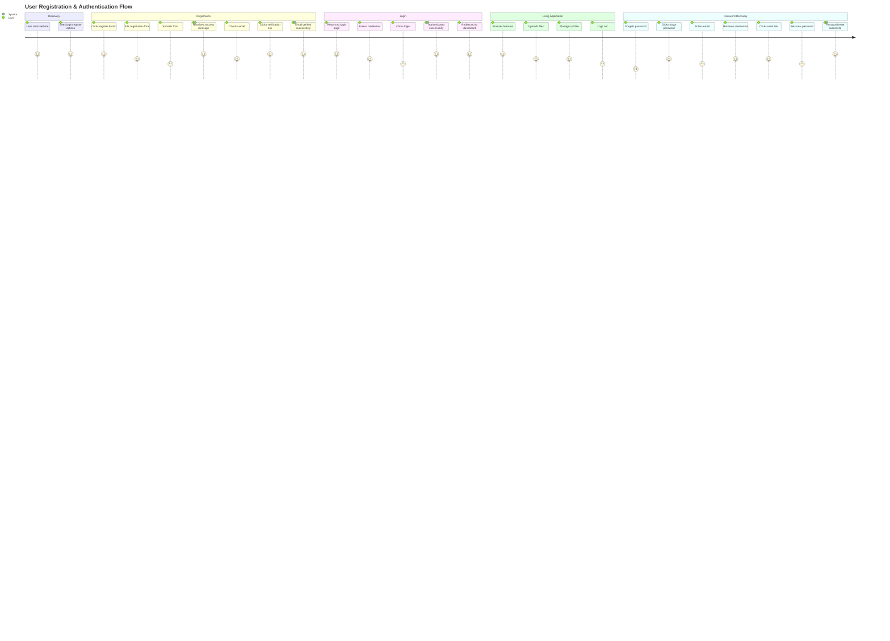
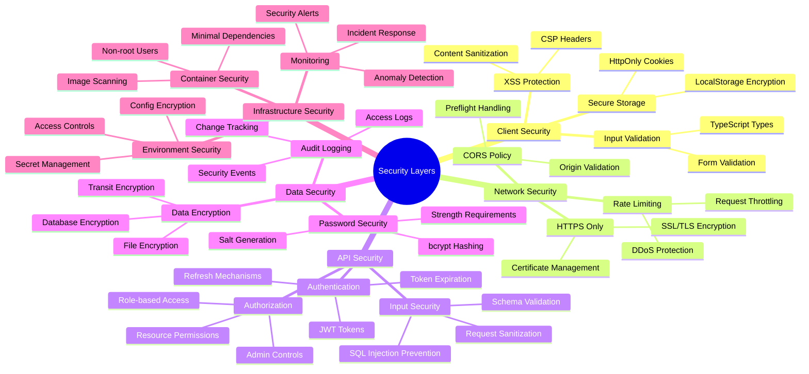
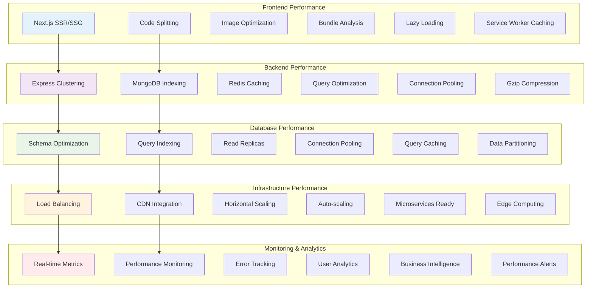
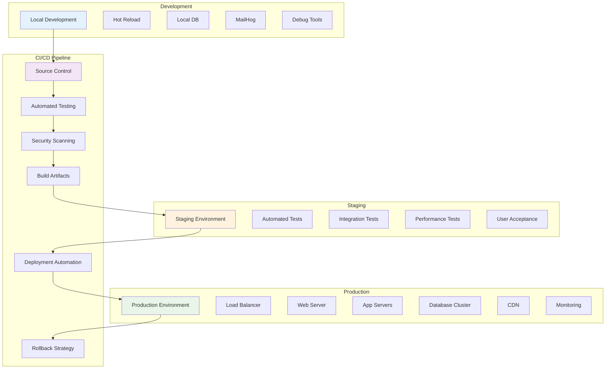
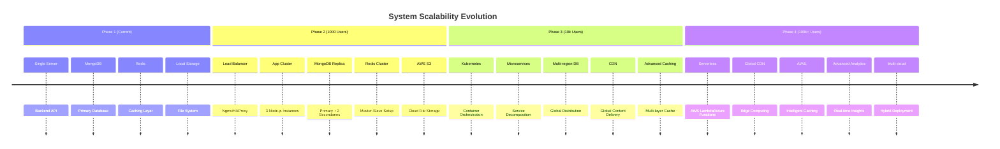
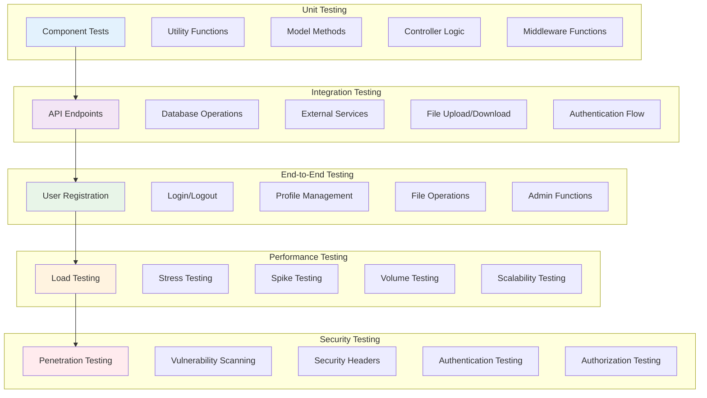

# 🌟 Complete MERN System Overview

Comprehensive architecture overview of the full-stack MERN authentication system with advanced features.

## 🏗️ System Architecture

```mermaid
graph TB
    subgraph "User Layer"
        U1[Web Browser]
        U2[Mobile App]
        U3[API Clients]
    end

    subgraph "Frontend Layer (Next.js)"
        F1[Next.js App Router]
        F2[React Components]
        F3[Authentication Context]
        F4[HTTP Client (Axios)]
        F5[TypeScript]
        F6[Tailwind CSS]
    end

    subgraph "API Gateway Layer"
        GW1[Express.js Server]
        GW2[CORS Handling]
        GW3[Rate Limiting]
        GW4[Security Headers]
        GW5[API Versioning (/v1)]
    end

    subgraph "Business Logic Layer"
        BL1[Authentication Controller]
        BL2[User Management Controller]
        BL3[File Upload Controller]
        BL4[Middleware Pipeline]
        BL5[Input Validation]
        BL6[Error Handling]
        BL7[API Monitoring]
    end

    subgraph "Data Access Layer"
        DA1[Mongoose ODM]
        DA2[MongoDB Atlas]
        DA3[Redis Cache]
        DA4[File Storage System]
    end

    subgraph "External Services"
        ES1[Email Service (SMTP)]
        ES2[MailHog (Development)]
        ES3[AWS S3 (Production)]
        ES4[JWT Token Service]
        ES5[Password Hashing (bcrypt)]
    end

    subgraph "Infrastructure"
        INF1[Docker Containers]
        INF2[Environment Config]
        INF3[Process Management (PM2)]
        INF4[Load Balancer]
        INF5[CDN]
    end

    subgraph "Development Tools"
        DEV1[Hot Reload]
        DEV2[TypeScript Compiler]
        DEV3[ESLint]
        DEV4[Prettier]
        DEV5[Jest Testing]
        DEV6[Swagger UI]
    end

    U1 --> F1
    U2 --> F1
    U3 --> GW1
    F1 --> GW1
    F2 --> F3
    F3 --> F4
    GW1 --> BL1
    GW1 --> BL2
    GW1 --> BL3
    BL1 --> DA1
    BL2 --> DA1
    BL3 --> DA4
    DA1 --> DA2
    DA1 --> DA3
    BL4 --> BL5
    BL5 --> BL6
    BL6 --> BL7
    BL1 --> ES4
    BL1 --> ES5
    BL1 --> ES1
    ES1 --> ES2
    ES1 --> ES3
    INF1 --> GW1
    INF2 --> GW1
    INF3 --> GW1
    DEV1 --> F1
    DEV2 --> F1
    DEV3 --> F2
    DEV4 --> F2
    DEV5 --> BL1
    DEV6 --> GW1

    style U1 fill:#e3f2fd
    style F1 fill:#f3e5f5
    style GW1 fill:#e8f5e8
    style BL1 fill:#fff3e0
    style DA1 fill:#ffebee
    style ES1 fill:#e1f5fe
    style INF1 fill:#f5f5f5
    style DEV1 fill:#e8f5e8
```

## 🔄 Complete User Journey



## 🎯 Feature Matrix

| Feature Category | Frontend (Next.js) | Backend (Express.js) | Database | External Services |
|------------------|-------------------|---------------------|----------|-------------------|
| **Authentication** | ✅ Login/Register Forms | ✅ JWT Auth Controller | ✅ User Model | ✅ Email Service |
| **User Management** | ✅ Profile Dashboard | ✅ CRUD Operations | ✅ Role-based Access | ✅ File Storage |
| **File Upload** | ✅ Drag & Drop UI | ✅ Multer Integration | ✅ File Metadata | ✅ AWS S3/Local |
| **Email System** | ❌ | ✅ Nodemailer/MailHog | ❌ | ✅ SMTP Services |
| **Caching** | ❌ | ✅ Redis Integration | ❌ | ✅ Cache Layer |
| **Monitoring** | ❌ | ✅ API Metrics | ✅ Performance Logs | ❌ |
| **Security** | ✅ Client-side Validation | ✅ Server Security | ✅ Data Encryption | ✅ Rate Limiting |
| **Testing** | ✅ Component Tests | ✅ API Tests | ✅ Database Tests | ✅ Integration Tests |
| **Documentation** | ✅ Component Docs | ✅ API Docs (Swagger) | ✅ Schema Docs | ✅ Service Docs |
| **Deployment** | ✅ Docker Ready | ✅ Containerized | ✅ Cloud DB | ✅ CDN Ready |

## 🔐 Security Implementation



## 📊 Performance Optimization



## 🚀 Deployment Strategy



## 📈 Scalability Roadmap



## 🧪 Testing Strategy



## 🎯 Technology Stack Summary

### **Frontend Technologies**
- **Framework:** Next.js 15 (App Router)
- **Language:** TypeScript
- **Styling:** Tailwind CSS
- **State Management:** React Context + Hooks
- **HTTP Client:** Axios
- **UI Components:** Radix UI + Custom Components
- **Form Handling:** React Hook Form + Zod Validation

### **Backend Technologies**
- **Runtime:** Node.js 18 LTS
- **Framework:** Express.js
- **Language:** ES6+ JavaScript
- **API Documentation:** Swagger/OpenAPI 3.0
- **Authentication:** JWT (jsonwebtoken)
- **Validation:** express-validator
- **Security:** Helmet, CORS, Rate Limiting

### **Database Technologies**
- **Primary Database:** MongoDB (Mongoose ODM)
- **Caching:** Redis
- **File Storage:** Local Filesystem / AWS S3
- **Migrations:** Custom migration system
- **Seeding:** Automated data seeding

### **Infrastructure & DevOps**
- **Containerization:** Docker + Docker Compose
- **Process Management:** PM2 (production)
- **Environment Management:** Custom env loader
- **Monitoring:** Built-in API metrics
- **Email Testing:** MailHog (development)

### **Development Tools**
- **Version Control:** Git
- **Code Quality:** ESLint, Prettier
- **Testing:** Jest, React Testing Library
- **API Testing:** Swagger UI, Postman
- **Documentation:** Markdown + Mermaid diagrams

## 🚀 Quick Start Guide

### **Prerequisites**
- Node.js 18+
- Docker & Docker Compose
- MongoDB (local or Atlas)
- Redis (optional)

### **Development Setup**
```bash
# 1. Clone repositories
git clone <frontend-repo>
git clone <backend-repo>

# 2. Setup backend
cd backend
cp env-example.txt .env
npm install
docker-compose --env-file env/development.env up -d
npm run migrate && npm run seed
npm run dev

# 3. Setup frontend (in another terminal)
cd ../frontend
npm install
npm run dev
```

### **Access Points**
- **Frontend:** `http://localhost:3000`
- **Backend API:** `http://localhost:5000/api/v1`
- **API Docs:** `http://localhost:5000/api-docs`
- **Email Testing:** `http://localhost:8025`
- **Health Check:** `http://localhost:5000/api/v1/health`

## 📚 Documentation Structure

```
docs/
├── API.md              # Complete API reference
├── ARCHITECTURE.md     # System architecture overview
├── BACKEND.md          # Backend implementation details
├── COMPONENTS.md       # Frontend component documentation
├── DEVELOPMENT.md      # Development guidelines
├── REQUIREMENT.md      # System requirements
├── SETUP.md           # Installation guide
└── SYSTEM-OVERVIEW.md # This file - complete system overview
```

---

## 🎉 System Highlights

### **✅ Production Ready Features**
- **Security First:** Comprehensive authentication, authorization, and data protection
- **Scalable Architecture:** Horizontal scaling support with Redis caching
- **Developer Experience:** Hot reload, comprehensive testing, and documentation
- **Monitoring & Observability:** Real-time metrics and error tracking
- **Multi-Environment:** Development, staging, and production configurations

### **🔥 Advanced Capabilities**
- **Email Verification:** Complete user verification workflow
- **File Management:** Multi-format upload with cloud storage integration
- **Admin Dashboard:** User management and system monitoring
- **API Versioning:** Future-proof API design with v1 implementation
- **Caching Strategy:** Multi-layer caching for optimal performance

### **🚀 Modern Development Practices**
- **TypeScript:** Type-safe frontend development
- **ES6+ Modules:** Modern JavaScript throughout
- **Atomic Design:** Scalable component architecture
- **RESTful APIs:** Clean, consistent API design
- **Containerization:** Docker-ready deployment

---

**This MERN system represents a complete, enterprise-grade web application foundation with modern architecture, comprehensive security, and production-ready scalability.** 🌟
